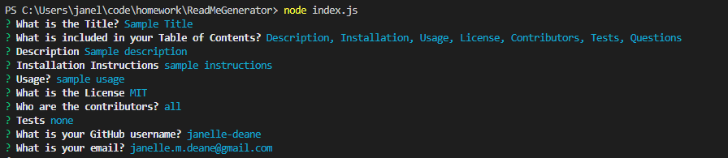

# The Best Readme Generator
  
   ## Table of Contents: 
   
* [Description](#Description)

* [Installation](#Installation)

* [Usage](#Usage)

* [License](#License)

* [Contributors](#Contributors)

* [Tests](#Tests)

* [Questions](#Questions)

   ## Description: 
   Create a fantastic readme with ease! This Node.js uses the following technologies: JavaScript Node.js, Shields.io, npm and inquirer.js. 
   ## Installation: 

   Installation Instructions

   npm install
   ## Usage: 

   Usage Information 

   Go to the appropriate terminal for ReadMeGenerator. You then want to install the dependencies. Next you want to run Node index.js and answer the prompted question to have your readme generated! Finally you can add any details you may need like pictures or videos. 

    Sample Questions 
    
  
    Video of Readme Generator in Action
    
    

    
   ## License
   
   
   ## Contributors: 

   Contribution Guidelines

   @janelle-deane
   ## Tests: 

   Test Instructions

   none
   ## Questions: 
   Feel free to reach out to me either on my github or email. 
   
   Github:
   https://github.com/janelle-deane/
   
   Email:
   janelle.m.deane@gmail.com